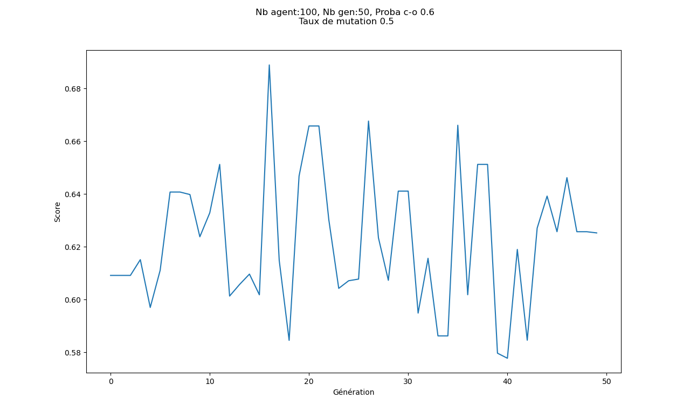
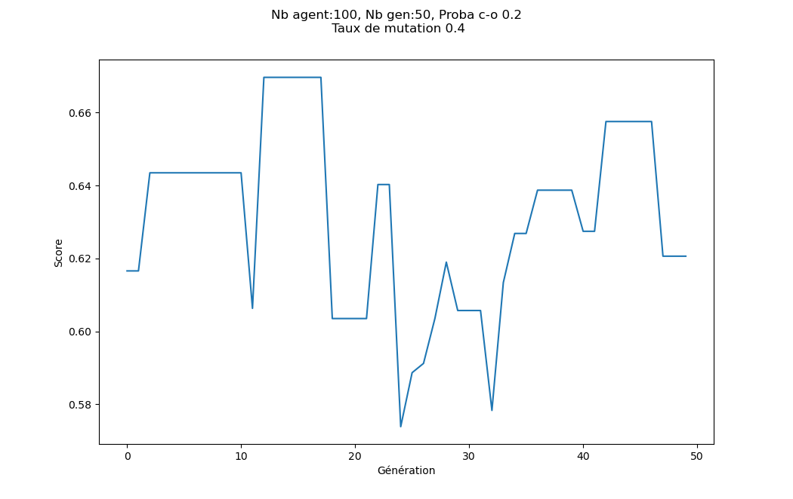
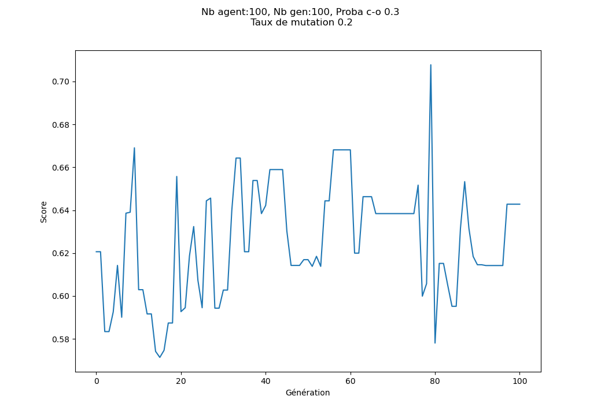
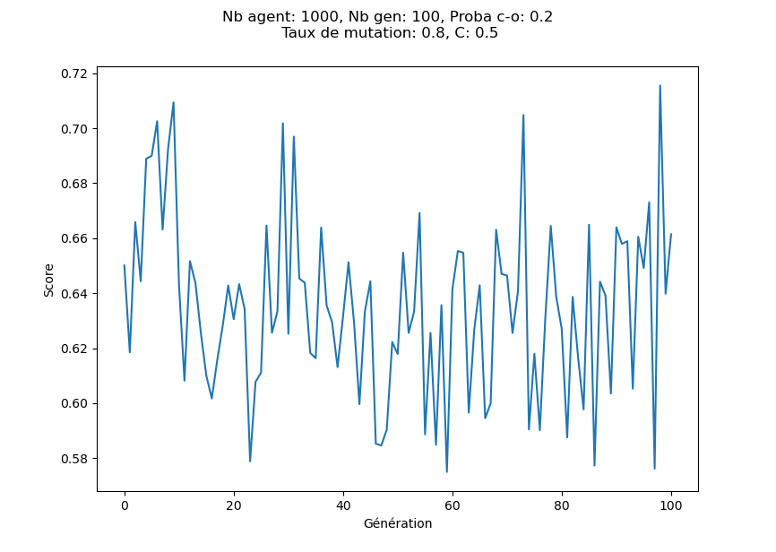

## Introduction
Un individu correspond donc à une tentative de mdp, son phénotype étant une chaîne de de 12 à 18 chiffre et lettres majuscules

## Codage du génotype
Comme génotype pour la première implémentation, j'ai choisi d'utiliser la conversion des caractères en nombres binaires. Il y a 36 caractères ([A-Z0-9]) à représenter plus une caractère vide, car le nombre de caractère composant le mot de passe entre 12 et 18 caractères. On encode donc les caractères avec 6 bits. Pour la conversion en phénotype, on utilisera donc une table d'équivalence.
Pour la seconde implémentation le génotype sont les caractères pouvant composer le mot de passe c'est à dire les lettre de A à Z, de 0 à 9 et le caractère vide car la taille du mot de passe peut être changeant. Il n'y a donc pas de conversion à faire entre le phénotype et le génotype.

## La sélection (et la présence ou non d'élitisme)
La sélection est une sélection linéaire par le rang, sans élitisme
La sélection est une sélection exponentiel par le rang en faisant varier C on peut avoir une seélection plus ou moin éllitiste

## Les mutations
Pour la première implémentation, une mutation fait passer changer la valeur d'un bit de 0 à 1 ou de 1 à 0.
La seconde implémentation, une mutation fait changer la valeur d'un caractère en un caractère aléatoire parmi ceux potentiellement présent dans le mot de passe([A-Z0-9 ]).

## Le cross-over
Pour la première et la seconde implémentaiton un cross-over se fait par caractère de 1 à N-1 caractères par cross-over.

## Les valeurs des hyper-paramètre (nombre d'individu, taux de mutation, etc.)
### Étude de la première implémentation
La première exécution, on obtient :

{width=75%}

{width=75%}

On constate avec c'est deux graphiques que les agents ne tendent pas vers une solution proche ou égale au mot de passe cherché. En réalisant plusieurs autres exécutions en faisant varier les paramètres, on ne temps pas plus vers une solution stable, dû peut-être à une probabilité de mutation trop haute.

{width=75%}

Après implémentation de la sélection exponentiel par rang, on n'a pas de meilleur résultat comme peut nous le monter le graphique suivant.

{width=75%}

Les résultats ne sont pas bon, c'est pourquoi j'ai réalisé une seconde implémentation avec un génotype différent décrit précédemment.

### Étude de la seconde implémentation

#### Note personnel
Une classe individu
    -def mutation
    -def evaluation

le phénotype est une chaine de caractère entre 12 et 18 caractères
le génotype contient une chaine de caractère codé

codage en code ascii

operateur de mutation

cross over

pc =  proba cross over
$\mu$ = proba mutation by bit

codage de gray pour les 

Après

* plusieurs cross-over et plusieurs mutation
* random sur les mutations
* Pas gerer les caractères vide, le faire qu'a la création
* lors du cross-over faire des changements d'ordre
* faire une mutation qui enlève ou supprime un caractère
* Au pire : Après avoir atteind 0.90, on selectionne le mdp qui atteind 0.90, on peut faire du brut force

Implementation 1:
500,1500,0.1,0.4,0.99,5

Implementation 
good param 500,1500,0.1,0.1,0.98,5
Implementation 2:
good param 500,1500,0.1,0.2,0.98,5

Implementaion 3:
500,1500,0.1,0.4,0.98,5s

Pour le numéo étudiant 11914433,  le mdp est XDLEV31N4RD32
