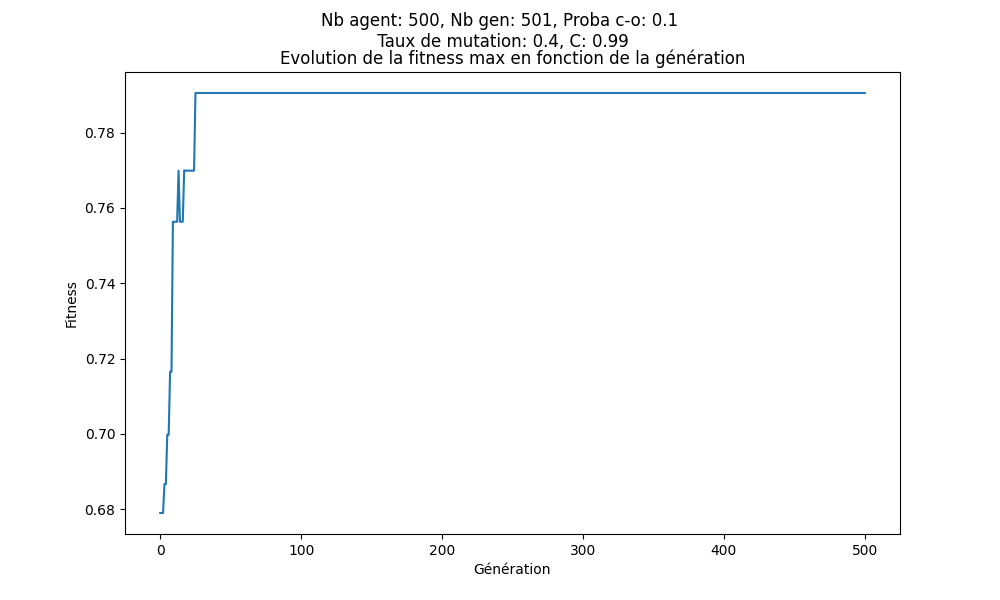
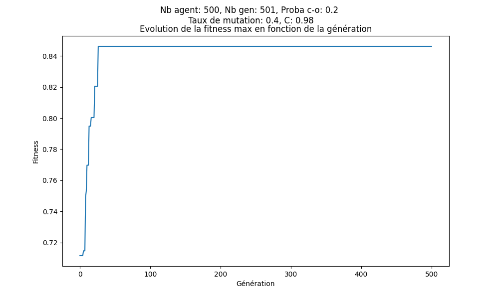
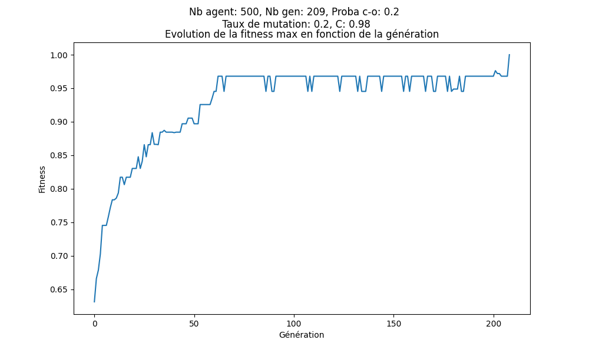
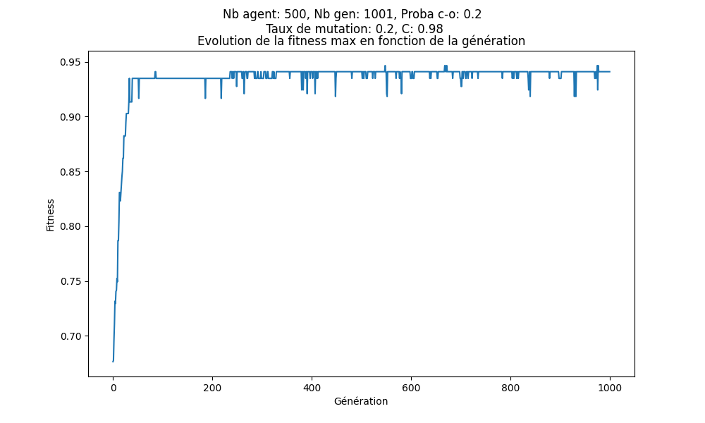
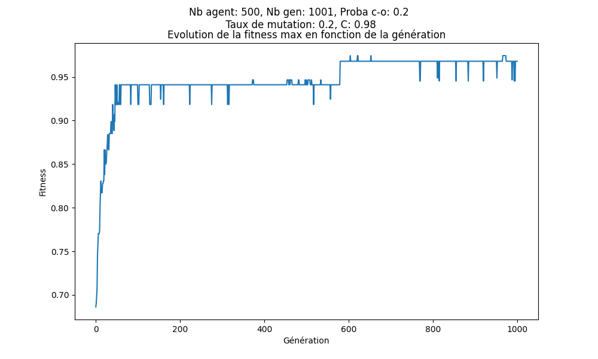
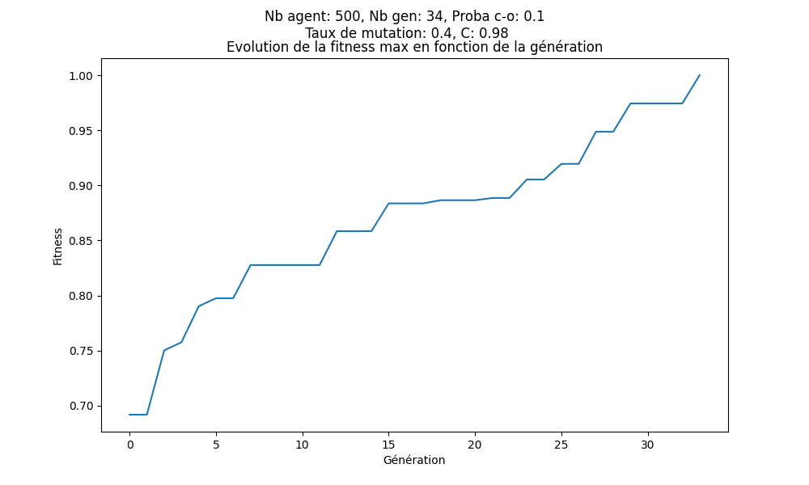
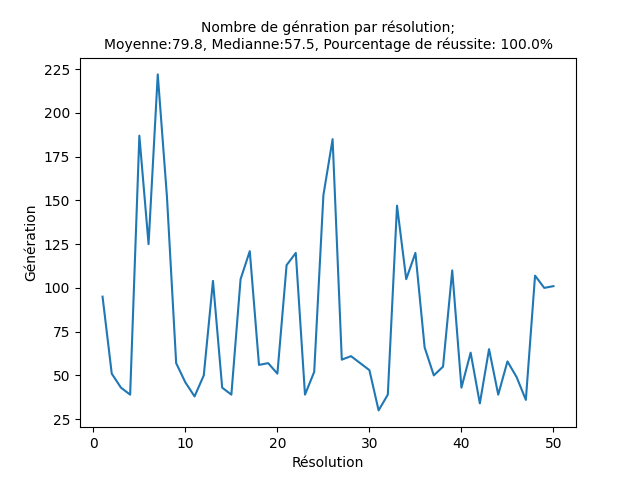

## Introduction
Pour résoudre le problème de recherche de mot de passe, j'ai réalisé 3 implémentations différentes comportant des variantes dans la manière de résoudre le problème. Les implémentations 2 et 3 ont été réalisée après l'analyse de l'implémentation précédente et en essayant de résoudre les lacunes de l'implémentation précédente. Chaque partie décrira chaque implémentation en parallèle et la dernière partie analysera les différences entre les différentes implémentations avec leurs hyper-paramètre.

## Codage du génotype
Pour génotype de la première implémentation, j'ai choisi d'utiliser un codage des caractères en nombres binaires. Le nombre de caractère à encoder en binaire est de 36 caractères soit les caractères de A à Z, de 0 à 9 et le caractère vide. La présence du caractère vide est justifié pour faire varier le nombre de caractère composant le mot de passe dans notre cas le mot de passe est composé entre 12 et 18 caractères. On encode les caractères avec 6 bits. Pour la conversion en phénotype, on utilisera donc une table d'équivalence.

Pour l'implémentation 2, le génotype est un tableau contenant les caractères composant un mot de passe c'est-à-dire les caractères de A à Z, de 0 à 9 et le caractère vide. Pour passer du génotype au phénotype, on fera une conversion de la liste de caractère(le génotype) en chaine de caractère.

Le génotype de l'implémentation 3 est une variante de celui de l'implémentation 2, on enlève seulement le caractère vide parmi les valeurs possible dans le tableau de caractère. Nous verrons par la suite que le nombre de caractère composant un mot de passe variera par mutation pour compenser l'absence du caractère vide parmi les caractères possible dans les génotypes.

## La sélection
Pour les différentes implémentations, il est possible d'exécuter l'algorithme génétique avec le programme avec une sélection:

* linéaire par le rang, sans élitisme

* exponentielle par le rang

En faisant varier C on peut avoir une sélection plus ou moins élitiste. La variable C fera donc partie des hyper-paramètres des algorithmes génétiques implémentés. Pour les trois implémentations, on utilisera la sélection exponentielle par le rang.

## Les mutations
Pour la première implémentation, la fonction de mutation change la valeur d'un bit présent dans un génotype aléatoirement de 0 à 1 ou de 1 à 0. Chaque bit à une probabilité $\mu$ de muter et on réalise une seule mutation par génotype par génération.

La seconde implémentation, possède une fonction de mutation qui fait changer un caractère en un caractère aléatoire parmi ceux potentiellement présent dans le mot de passe soit les caractères de A à Z, de 0 à 9 et le caractère vide.

La troisième implémentation possède 7 fonctions différentes de mutation. Pour chaque génotype on réalise une mutation avec une probabilité de $mu$(le taux de mutation ne sera pas comparable avec les autres implémentations). Chaque mutation a une probabilité d'être appelé.  
Les différentes mutations de l'implémentation 3 et leur probabilité sont:

1. Mutation aléatoire (probabilité 2/8): On change la valeur d'un caractère aléatoirement.

2. Mutation réduction de taille du génotype (probabilité 1/8): On enlève aléatoirement un caractère dans le génotype si le nombre de caractère est supérieur à 12 caractères.

3. Mutation agrandissement (probabilité 1/8): On ajoute un caractère aléatoire à une position aléatoire.

4. Mutation échange (probabilité 1/8): Intervertie de place deux caractères aléatoirement présent dans le génotype.

5. Mutation remplacement (probabilité 1/8): On retire aléatoirement un caractère dans le génotype et on ajoute un caractère à une position aléatoire.

6. Mutation décalage à droite (probabilité 1/8): On supprime le génome situé à la fin du génotype et on rajoute un caractère aléatoire en première position.

7. Mutation décalage à gauche (probabilité 1/8): On supprime le génome situé au début du génotype et on rajoute un caractère aléatoire en dernière position.

## Le cross-over
Pour la première implémentation, on réalise un cross-over en intervertissant une portion de même taille entre deux parents. Pour conserver le sens des données manipulées, on ne coupe pas le génotype n'importe où, on réalise une coupe entre caractère c'est-à-dire tous les 6 bits. Le cross-over produit alors deux enfants avec une combinaison différente des deux parents.

Pour l'implémentation 2 et 3, on réalise un cross-over en intervertissant une portion de caractère de même taille entre deux parents pour produire deux enfants avec une combinaison différente des deux parents.

## Analyse des résultats

### Étude de la première implémentation
Après plusieurs exécutions pour obtenir des résultats prometteurs en modifiant les hyper-paramètres, on obtient:

{width=75%}

Il semblerait qu'il y ait peu de diversité, la probabilité de cross-over étant un peu basse on la passe à 0.2 et on obtient le résultat suivant :

{width=75%}

Les résultats après plusieurs exécutions restent autour de 80%. En analysant l'implémentation on constate que l'on tombe rarement sur le caractère vide. Cela est dû au codage du caractère vide. Le caractère vide est codé en binaire par `000000` étant donné que l'on change aléatoirement un binaire lors d'une mutation, il y a moins de chance de tomber sur la combinaison `000000`(caractère vide) et `111111` (pas utilisé dans notre implémentation) que de tomber sur un nombre avec au moins un binaire à 1.

Une seconde raison est que certain nombre de binaire présent dans les génotypes n'ont pas d'équivalence dans la table d'équivalence et sont donc considérés comme caractère vide, ce qui diminue alors les chances de tomber sur la valeur optimale et de rendre efficace les mutations. Avec cette implémentation une mutation peu donc dans certain cas ne pas changer le phénotype.

### Étude de la deuxième implémentation
Pour résoudre le problème, on va donc se rapprocher du problème pour le génotype. J'ai donc codé l'implémentation 2 décrite précédemment. Tous de suite après les premières exécutions, on obtient de bien meilleur résultat et on arrive même à trouver la solution optimale soit le mot de passe: `11914433` pour l'ID étudiant `XDLEV31N4RD32`.

{width=75%}

Ces résultats nous montrent que les mutations et le cross-over nous permettent d'atteindre la solution optimale, mais l'on constate que l'on ne trouve pas souvent la solution optimale, on reste bloqué le plus souvent dans des maximums locaux.

{width=75%}

{width=75%}

### Étude de la troisième implémentation
Ces plafonds montrent un manque de diversité génétique, j'ai donc réalisé l'implémentation 3 pour pallier au problème. On obtient des résultats bien meilleurs, on peut trouver la solution en 34 générations soient en 170 appels du programme `unlock64.exe` car on réalise à chaque génération une moyenne de 5 appels pour les mêmes individus pour pallier aux variations des résultats de fitness retournés par `unlock64.exe`.

{width=75%}

Mais encore avec cette implémentation, il arrive de tomber dans un maximum local pendant plus de 300 générations, pour pallier au problème et accélérer la résolution, il est plus avantageux de repartir sur une nouvelle génération aléatoire dès que la fitness maximum de l'ensemble des individus d'une génération reste inchangé pendant 25 générations.

{width=75%}

Les résultats sont trouvés plus rapidement avec la méthode récréation d'une nouvelle génération avec des individus aléatoirement étant donné que l'on sait que le problème se résout en moyenne en 79.8 générations. Ce résultat est obtenu à l'aide du programme stat qui permet de connaitre la moyenne et la médiane du nombre de génération nécessaire pour trouver une solution. Il permet également d'obtenir le taux de réussite de l'algorithme génétique en un nombre limité de génération ici pour les tests 500 générations. Les statistiques ci-dessous(réalisés sur 50 résolutions), nous montre la robustesse de l'implémentation 3 et sa constance en nombre de génération (ne dépasse pas 225 générations), on n'a plus de pic à 400-500 génération.

{width=75%}

Bonus: Le décodage du mot de passe XDLEV31N4RD32 : LEVEINARD